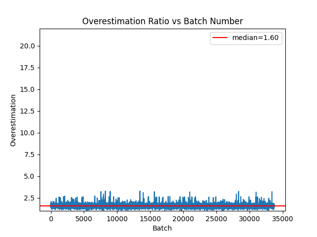
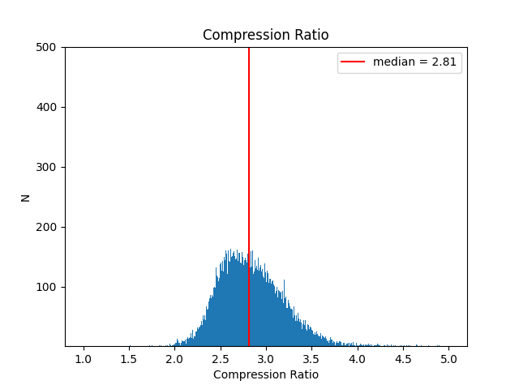
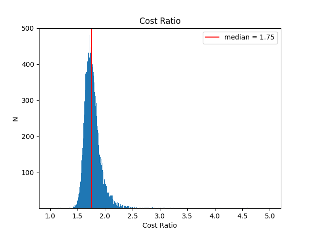

# Compression in Arbitrum Nitro

Arbitrum Nitro will feature calldata compression to save on gas costs for recording transaction batches on L1. This repository is a study of the relationship between compressibility of calldata and gas savings. One goal is to determine gas pricing for L2 transaction calldata, particularly in such a manner that incentivizes the user to construct calldata that increases the compressibility of an entire batch, if possible.

## Code
To install dependencies use the requirements file and a python virtual environment.
```sh
$ cd code
$ python3 -m venv venv
$ source ./venv/bin/activate
(venv) $ pip3 install -r requirements.txt
```

And to run it on your machine, you must first create an `.env` file with the following env variable:
```text
ETH_PROVIDER_URL=<your eth provider url>
```

## Reproducing the Data
The data was retrieved from the blockchain in a two-step process. It's not the most efficient code, but it got the job done. Fair warning, the transactions input data takes up about 5GiB of disk space.

First, we need to find where the data is. We begin by querying an Ethereum L1 node's json rpc for log events matching these event signatures:
```solidity
// source: https://github.com/OffchainLabs/arbitrum/blob/master/packages/arb-bridge-eth/contracts/bridge/interfaces/ISequencerInbox.sol

event SequencerBatchDelivered(
      uint256 indexed firstMessageNum,
      bytes32 indexed beforeAcc,
      uint256 newMessageCount,
      bytes32 afterAcc,
      bytes transactions,
      uint256[] lengths,
      uint256[] sectionsMetadata,
      uint256 seqBatchIndex,
      address sequencer
  );

event SequencerBatchDeliveredFromOrigin(
    uint256 indexed firstMessageNum,
    bytes32 indexed beforeAcc,
    uint256 newMessageCount,
    bytes32 afterAcc,
    uint256 seqBatchIndex
);
```
The `SequencerBatchDeliveredFromOrigin` doesn't emit the transactions data, but we'll get the raw transactions data in the second step. We use the `eth_getLogs` rpc method to get logs. This creates individual log files in [logs](./data/logs), and it creates a file with general data about all of the batches in [logs_info.json](./data/logs_info.json).
```sh
(venv) $ python3 get_batch_logs.py
```

Second, we retrieve the transaction inputs of each batch, which gives us the actual transaction data that will be compressed. This script takes a while: the eth json rpc method `eth_getTransactionByHash` only accepts one hash at a time. I'm sure there's a better method but I adapted [some code](https://blog.jonlu.ca/posts/async-python-http) that parallelizes the network requests, so it's still decently fast considering it's querying 33k+ logs. It downloads about 5GiB of data from the node.
```sh
(venv) $ python3 get_batch_transactions.py
```

We have all of the raw data in [logs](./data/logs) and [transactions](./data/transactions). We are interested in the "input" parameter in particular, which can be decoded to retrieve the arguments of one of the original function calls:
```
// source: https://github.com/OffchainLabs/arbitrum/blob/master/packages/arb-bridge-eth/contracts/bridge/SequencerInbox.sol

function addSequencerL2BatchFromOrigin(
  bytes transactions,
  uint256[] lengths,
  uint256[] sectionsMetadata,
  bytes32 afterAcc
) { /* ... */ }

function addSequencerL2BatchFromOriginWithGasRefunder(
  bytes transactions,
  uint256[] lengths,
  uint256[] sectionsMetadata,
  bytes32 afterAcc,
  address gasRefunder
) { /* ... */ }
```

## Generating the Results

Only after retrieving the data from the blockchain can the compression simulation begin. 

```sh
(venv) $ python3 simulate_batch_compression.py
```

To understand the results, let's first glance at an individual results file.
```json
{
  "compressed_n_zeros": 108,
  "compressed_size": 24863,
  "compressed_cost": 396512,
  "uncompressed_n_zeros": 48503,
  "uncompressed_size": 82912,
  "uncompressed_cost": 744556,
  "compression_ratio": 3.334754454410168,
  "space_saving": 0.7001278463913547,
  "cost_ratio": 1.877764102977968,
  "gas_saving": 0.46745174305223514
}
```

1. Delineate calldata into the number of zero bytes and number of nonzero bytes present. Each type of byte has its own gas cost for being submitted to the Ethereum chain, (4 gas and 16 gas, respectively).
2. Compress the calldata using two methods.
 - Use *all* of the `data` parameter of the sequencer L1 batch transaction, except for the function selector.
 - V2: Use only the decoded `transactions` argument from the function call.
3. Compute the compression ratio by the change in calldata length. 
4. Compute the cost ratio by the change in cost of L1 calldata.
5. Compute the "overestimation ratio" by the ratio of compression ratio to cost ratio.

## Visualizing the Results

The [V2 results](./data/imagesV2), where only the calldata of the concatenated L2 transaction data is compressed, are presented here. The batch numbers are in order of the time that they were submitted to L1. The plots share limits on the axes to illustrate their overall relative difference.







